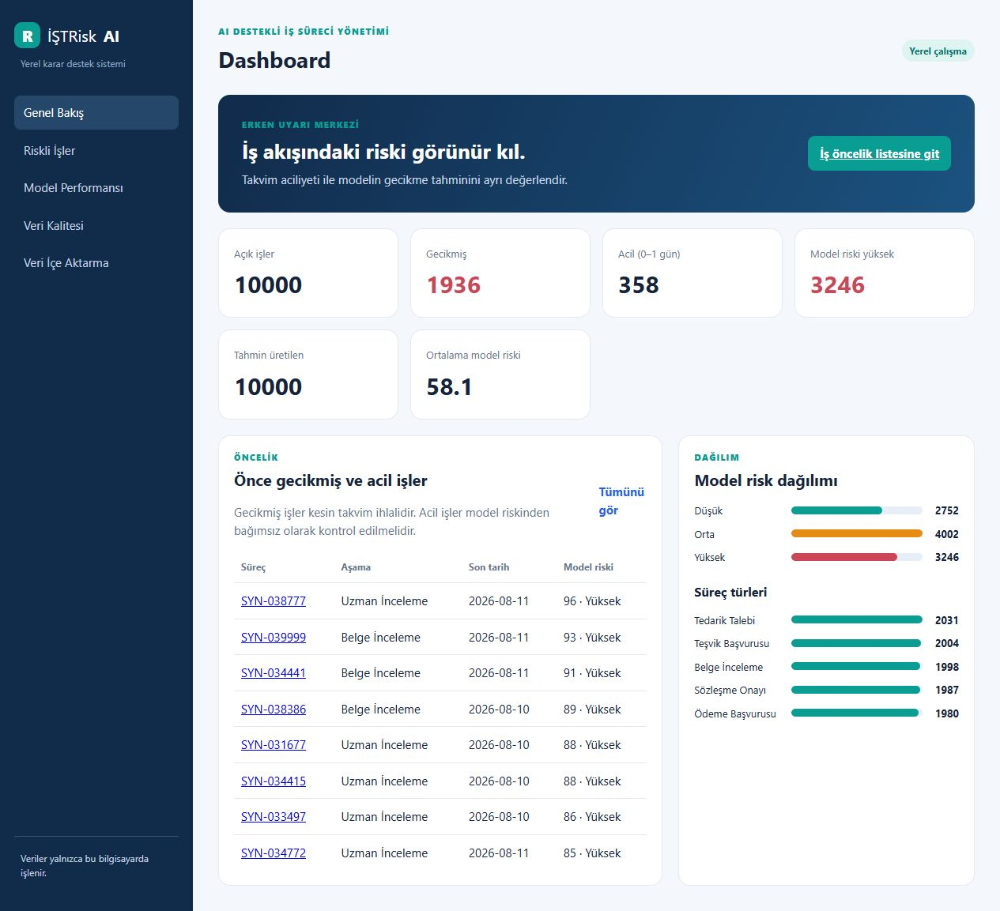
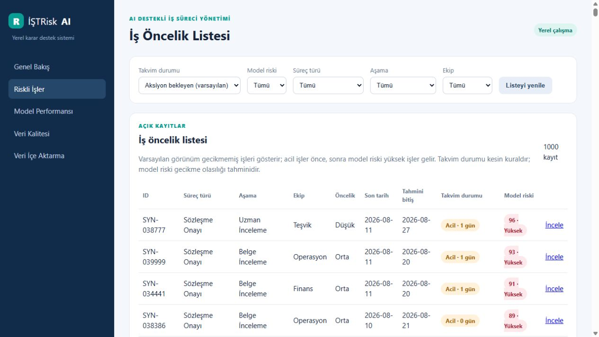
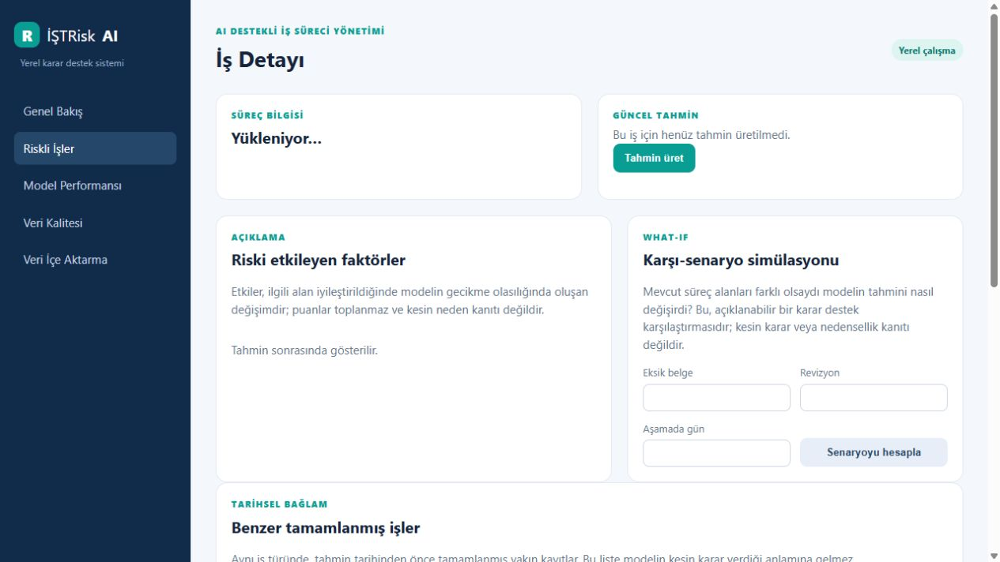
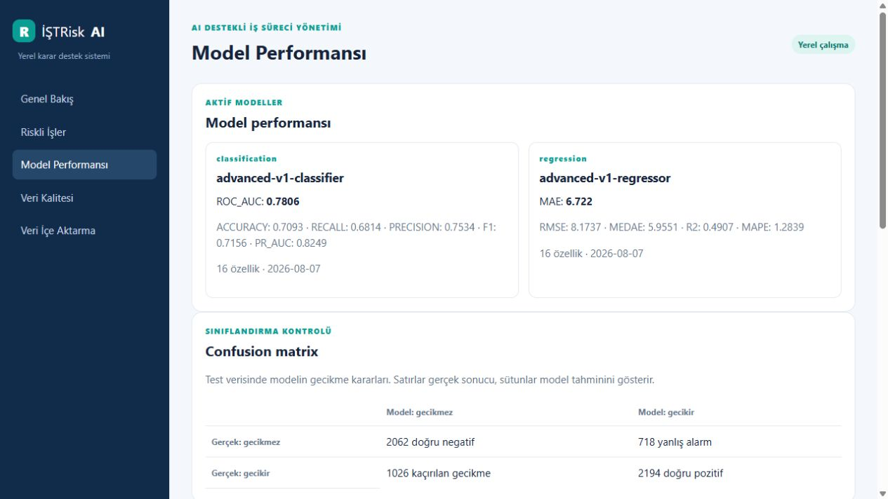

# Kısa Kullanım Kılavuzu

## Uygulamayı açma

Tarayıcıdan `http://127.0.0.1:8001/` adresini açın. Uygulama yalnız yerel bilgisayarda çalışır.

## 1. Dashboard

Dashboard; açık iş, gecikmiş iş, acil iş, yüksek model riski ve ortalama riski özetler. Gecikmiş iş takvim kuralıdır; model riski ise gecikme olasılığı tahminidir.

**Açık işleri değerlendir** düğmesi, açık işlerin bugüne ait tahminini arka planda üretir. Kaynak süreç kaydını değiştirmez; tahmin geçmişine yeni tahmin kaydı ekler. Çalışma süresince ilerleme görünür. Gerekirse **İşlemi durdur** düğmesi yeni kayıtlar için üretimi keser; o ana kadarki tahminler korunur.

## 2. İş öncelik listesi

Varsayılan liste gecikmemiş, aksiyon bekleyen işleri gösterir. İsteğe bağlı olarak takvim durumu, model riski, süreç türü, aşama ve ekip filtresi seçilebilir.

`Tahmini bitiş`, modelin tahmini kalan gününü bugüne ekleyen tahmini tarihtir; kesin teslim tarihi değildir.

## 3. İş detayı

Bir işi **İncele** ile açın.

- **Tahmini güncelle:** Yeni gün, yeni model sürümü veya değişmiş süreç verisi varsa güncel tahmini kaydeder. Aynı gün aynı veri için yeni geçmiş kaydı oluşturmaz.
- **Riski etkileyen faktörler:** Modelin hangi süreç alanlarına duyarlı olduğunu gösterir.
- **Karşı-senaryo:** Eksik belge, revizyon ve aşamada gün değerleri farklı olsaydı tahminin nasıl değişeceğini gösterir. Kaydı değiştirmez.
- **Benzer tamamlanmış işler:** Geçmişteki yakın örneklerdir; kesin karar kanıtı değildir.
- **Tahmin geçmişi:** Farklı tarihlerde veya model sürümlerinde kaydedilmiş tahminleri gösterir.

Son tarihi geçmiş işlerde karşı-senaryo, zamanında bitme erken uyarısı vermez; çünkü takvim ihlali zaten gerçekleşmiştir.

## 4. Model performansı

Bu sayfada aktif model sürümü, eğitim/test metrikleri, confusion matrix, kullanıcı geri bildirimleri ve gerçek sonuç girilmiş kayıtlar üzerinde saha performansı görünür.

> Görseller uygulamanın yerel, sentetik verili demo ortamından alınmıştır; gerçek kişi veya kurum verisi içermez.

## 5. Veri kalitesi ve içe aktarma

Veri Kalitesi ekranı eksik değerleri, tekrar kayıtları, aykırı değerleri ve red nedenlerini gösterir. Veri İçe Aktarma ekranından yalnız `.csv` veya `.xlsx` dosyası seçilir. Geçersiz satırlar veritabanına yazılmaz.

## 6. Geri bildirim

İş tamamlandığında İş Detayı ekranından tahmini faydalı/hatalı olarak değerlendirebilir ve gerçek sonucu girebilirsiniz. Bu, modeli anında değiştirmez; sonraki saha değerlendirmesi için yerel kayıt oluşturur.
